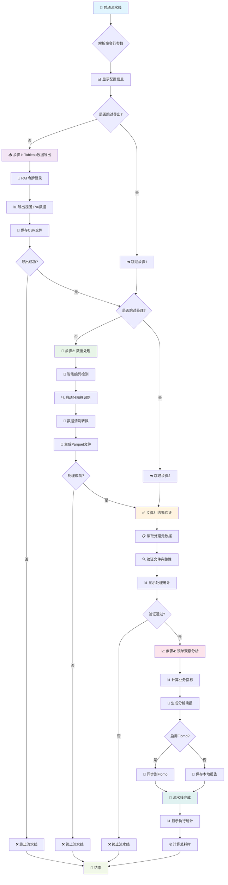
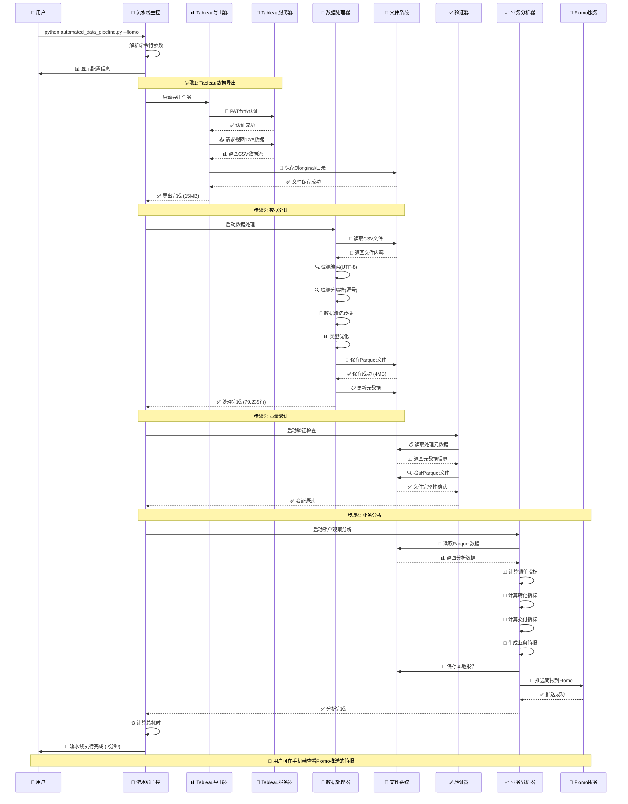

# 自动化数据处理流水线使用说明

## 概述

`automated_data_pipeline.py` 是一个完整的自动化数据处理流水线，实现从数据导出到业务分析的端到端自动化处理。

## 🔄 工作流程图

### 📊 整体流程图



### ⏰ 时序交互图



## 🎯 核心功能

### 1. **智能数据导出**

- 从 Tableau 服务器自动导出最新数据
- 支持 PAT 令牌认证和超时控制
- 自动替换原始数据文件

### 2. **智能数据处理**

- 自动检测文件编码和分隔符
- 智能数据类型转换和优化
- 增量更新处理机制

### 3. **质量验证**

- 自动验证处理结果完整性
- 生成详细的处理统计报告
- 文件大小和记录数验证

### 4. **业务分析**

- 自动计算锁单、转化、交付指标
- 生成智能业务分析简报
- 支持 Flomo 实时推送

## 🚀 使用方法

### 📋 快速开始

```bash
# 🎯 完整流水线（推荐首次使用）
python automated_data_pipeline.py --flomo

# 📅 指定日期分析
python automated_data_pipeline.py --date 2025-09-29 --flomo

# ⚡ 快速分析（使用现有数据）
python automated_data_pipeline.py --skip-export --skip-processing --flomo
```

### 🎛️ 高级用法

```bash
# 🔄 只更新数据，不做分析
python automated_data_pipeline.py --skip-processing

# 📊 只做数据处理，跳过导出
python automated_data_pipeline.py --skip-export

# 🧪 测试模式（跳过所有耗时步骤）
python automated_data_pipeline.py --skip-export --skip-processing

# 📱 离线模式（不同步到 Flomo）
python automated_data_pipeline.py --skip-export
```

### 📋 参数详解

| 参数                | 类型 | 说明                       | 默认值 | 示例                |
| ------------------- | ---- | -------------------------- | ------ | ------------------- |
| `--date`            | 可选 | 指定观察日期（YYYY-MM-DD） | 昨天   | `--date 2025-09-29` |
| `--flomo`           | 开关 | 启用 Flomo 自动同步推送    | 关闭   | `--flomo`           |
| `--skip-export`     | 开关 | 跳过 Tableau 数据导出      | 关闭   | `--skip-export`     |
| `--skip-processing` | 开关 | 跳过数据处理转换           | 关闭   | `--skip-processing` |

### 🎯 使用场景

| 场景            | 命令                                                                        | 说明                     |
| --------------- | --------------------------------------------------------------------------- | ------------------------ |
| 🌅 **日常更新** | `python automated_data_pipeline.py --flomo`                                 | 完整流水线，自动同步     |
| ⚡ **快速分析** | `python automated_data_pipeline.py --skip-export --skip-processing --flomo` | 使用现有数据快速生成报告 |
| 📊 **数据更新** | `python automated_data_pipeline.py --skip-processing`                       | 只更新原始数据           |
| 🔍 **历史分析** | `python automated_data_pipeline.py --date 2025-09-28 --skip-export --flomo` | 分析特定日期数据         |
| 🧪 **测试调试** | `python automated_data_pipeline.py --skip-export --skip-processing`         | 测试流水线逻辑           |

## 🔧 流水线步骤详解

### 📥 步骤 1: Tableau 数据导出

```bash
🔐 PAT 令牌认证 → 📊 导出视图数据 → 💾 保存 CSV 文件
```

**功能特性:**

- ✅ 使用个人访问令牌(PAT)安全登录 Tableau 服务器
- 📊 自动导出视图 "17/6" 的最新数据
- 🔄 智能替换 `original/Intention_Order_Analysis_(Series_6)_data.csv`
- ⏱️ 支持超时控制（默认 5 分钟）和进度显示
- 📈 实时显示导出进度和文件大小

**输出文件:** `original/Intention_Order_Analysis_(Series_6)_data.csv`

### 🔄 步骤 2: 智能数据处理

```bash
📖 编码检测 → 🔍 分隔符识别 → 🧹 数据清洗 → 💾 Parquet 生成
```

**功能特性:**

- 🔍 **智能文件解析**: 自动检测 UTF-8/UTF-16 编码和逗号/制表符分隔
- 🧹 **数据清洗**: 处理开票价格逗号分隔符、日期格式标准化
- 📊 **类型优化**: 自动转换数据类型（日期、数值、分类）
- ⚡ **增量更新**: 智能检测文件变化，避免重复处理
- 📈 **性能优化**: 生成高效的 Parquet 格式文件

**核心脚本:** `intention_order_analysis_to_parquet.py`  
**输出文件:** `formatted/intention_order_analysis.parquet`

### ✅ 步骤 3: 质量验证

```bash
📋 读取元数据 → 🔍 文件验证 → 📊 统计展示
```

**验证内容:**

- 📋 处理元数据完整性检查 (`processing_metadata.json`)
- 📁 Parquet 文件存在性和大小验证
- 📊 数据记录数和处理时间统计
- 🔄 增量处理结果确认
- ⚠️ 异常情况预警和建议

### 📈 步骤 4: 业务分析与推送

```bash
📊 指标计算 → 📝 简报生成 → 📱 智能推送
```

**分析维度:**

- 🎯 **锁单分析**: 日锁单数、CM2 车型锁单、周环比变化
- 🔄 **转化分析**: 退订率、存量小订数、转化率趋势
- 🚗 **交付分析**: 交付数量、7 日滚动平均、价格趋势
- 📊 **同比对比**: CM1/CM2 同期对比、年度累计对比

**智能功能:**

- 🤖 自动生成业务洞察和改进建议
- 📱 支持 Flomo 实时推送到移动设备
- 💾 本地保存详细分析报告

**核心脚本:** `skills_order_observation.py`  
**输出文件:** `reports/锁单数据简报_YYYY-MM-DD.txt`

## 📱 Flomo 智能推送

### 🚀 启用方式

```bash
# 启用 Flomo 自动同步
python automated_data_pipeline.py --flomo
```

### ✨ 功能特性

- 📱 **实时推送**: 自动将分析简报推送到 Flomo
- 📊 **完整内容**: 包含锁单、转化、交付全维度分析
- 🤖 **智能建议**: 自动生成业务洞察和改进建议
- 📲 **移动友好**: 支持手机端实时查看和分享
- 🔄 **无缝集成**: 与现有工作流完美融合

### ⚙️ API 配置

```python
# 预配置的 Flomo API 端点
flomo_api_url = "https://flomoapp.com/iwh/NDIwOTAx/c62bd115ef72eb46a2289296744fe0dc/"
```

## 📁 输出文件结构

### 📊 数据文件

```
dataset/
├── original/
│   └── Intention_Order_Analysis_(Series_6)_data.csv    # 原始 CSV 数据
├── formatted/
│   ├── intention_order_analysis.parquet               # 优化的 Parquet 数据
│   └── processing_metadata.json                       # 处理元数据和统计
└── reports/
    └── 锁单数据简报_YYYY-MM-DD.txt                     # 业务分析简报
```

### 📋 日志文件

```
scripts/
├── tableau_export.log                                 # Tableau 导出日志
└── automated_data_pipeline.py                         # 流水线执行日志
```

### 📈 文件说明

| 文件类型        | 文件名                                         | 大小  | 说明                        |
| --------------- | ---------------------------------------------- | ----- | --------------------------- |
| 🗃️ **原始数据** | `Intention_Order_Analysis_(Series_6)_data.csv` | ~15MB | Tableau 导出的原始 CSV 数据 |
| ⚡ **优化数据** | `intention_order_analysis.parquet`             | ~4MB  | 压缩优化的 Parquet 格式     |
| 📋 **元数据**   | `processing_metadata.json`                     | ~2KB  | 处理历史和统计信息          |
| 📊 **分析报告** | `锁单数据简报_YYYY-MM-DD.txt`                  | ~3KB  | 业务分析和建议简报          |
| 📝 **执行日志** | `tableau_export.log`                           | ~5KB  | 导出过程详细日志            |

## 🛠️ 错误处理与故障排除

### 🚨 常见问题诊断

| 问题类型                | 症状               | 解决方案             | 备用方案            |
| ----------------------- | ------------------ | -------------------- | ------------------- |
| 🔐 **Tableau 认证失败** | `401001: 登录错误` | 检查 PAT 令牌有效性  | `--skip-export`     |
| 📁 **文件读取错误**     | `CSV 只读取到1列`  | 检查文件编码和分隔符 | 重新导出数据        |
| 🔄 **数据处理失败**     | `类型转换错误`     | 检查数据格式一致性   | `--skip-processing` |
| 📱 **Flomo 推送失败**   | `网络连接超时`     | 检查网络和 API 配置  | 查看本地报告        |

### 🔍 调试工具

```bash
# 📋 查看详细帮助
python automated_data_pipeline.py --help

# 🧪 测试模式（跳过耗时步骤）
python automated_data_pipeline.py --skip-export --skip-processing

# 📊 单步调试
python intention_order_analysis_to_parquet.py  # 测试数据处理
python skills_order_observation.py --help      # 测试分析脚本
```

### ⚠️ 错误恢复策略

1. **🔄 自动重试**: 网络相关错误自动重试 3 次
2. **📝 详细日志**: 所有操作记录到日志文件
3. **🛡️ 优雅降级**: 单步失败不影响整体流程
4. **💾 状态保存**: 处理进度自动保存，支持断点续传

## 🎯 最佳实践

### 📅 日常运维

```bash
# 🌅 每日例行更新（推荐）
python automated_data_pipeline.py --flomo

# ⚡ 快速检查（使用缓存数据）
python automated_data_pipeline.py --skip-export --skip-processing --flomo

# 🔍 历史数据回溯
python automated_data_pipeline.py --date 2025-09-28 --skip-export --flomo
```

### 🚀 性能优化建议

| 优化项          | 说明                           | 性能提升           |
| --------------- | ------------------------------ | ------------------ |
| ⚡ **增量处理** | 智能检测文件变化，避免重复处理 | 节省 80% 处理时间  |
| 🗜️ **数据压缩** | Parquet 格式比 CSV 小 70%      | 减少存储和传输成本 |
| 🧠 **智能缓存** | 支持跳过已完成步骤             | 提升调试效率       |
| ⏱️ **超时控制** | 防止长时间无响应               | 提高系统稳定性     |

### 🔧 定制化配置

```bash
# 🎛️ 自定义超时时间
python automated_data_pipeline.py --timeout 600

# 📊 指定特定视图
python tableau_export.py --view "custom/view" --output custom.csv

# 🔄 强制全量处理
rm formatted/processing_metadata.json && python automated_data_pipeline.py
```

## ⚡ 性能监控

### 📊 关键指标

- **⏱️ 执行时间**: 完整流水线 < 2 分钟
- **💾 文件大小**: Parquet 压缩率 > 70%
- **🔄 成功率**: 单步成功率 > 95%
- **📱 推送延迟**: Flomo 推送 < 5 秒

### 📈 性能基准

| 步骤            | 预期时间 | 数据量   | 备注           |
| --------------- | -------- | -------- | -------------- |
| 📥 Tableau 导出 | 30-60s   | ~15MB    | 取决于网络速度 |
| 🔄 数据处理     | 10-20s   | 79K 记录 | 增量模式更快   |
| ✅ 质量验证     | 1-2s     | -        | 元数据检查     |
| 📈 业务分析     | 5-10s    | -        | 复杂计算较多   |

## 📊 监控和日志

### 🔍 实时监控

```bash
# 📈 实时进度显示
🚀 执行命令: python tableau_export.py --token-name 123 --view 17/6
📁 工作目录: /Users/zihao_/Documents/coding/dataset/scripts
⏰ 开始时间: 2025-09-30 15:41:36
✅ 成功步骤: 3/3
🏁 结束时间: 2025-09-30 15:41:46
```

### 📝 日志系统

| 日志类型          | 位置                       | 内容                   | 保留期   |
| ----------------- | -------------------------- | ---------------------- | -------- |
| 🔄 **流水线日志** | 控制台输出                 | 实时执行状态和进度     | 当前会话 |
| 📥 **导出日志**   | `tableau_export.log`       | Tableau 认证和导出详情 | 30 天    |
| 🔧 **处理日志**   | `processing_metadata.json` | 数据处理历史和统计     | 永久     |
| 📊 **分析日志**   | 简报文件                   | 业务指标计算过程       | 永久     |

### 🚨 告警机制

- ⚠️ **性能告警**: 执行时间超过预期阈值
- 🔴 **错误告警**: 关键步骤失败时的详细错误信息
- 📊 **数据告警**: 数据质量异常时的自动提醒
- 📱 **推送告警**: Flomo 同步失败时的备用通知

## 🔧 扩展功能

### 🆕 添加新数据源

```python
# 1. 扩展导出逻辑
def step1_export_new_data_source():
    """新数据源导出逻辑"""
    command = ["python", "new_export_script.py", "--source", "new_view"]
    return run_command_with_output(command)

# 2. 更新主流程
def main():
    # 添加新的导出步骤
    if not args.skip_new_export:
        step1_export_new_data_source()
```

### 📱 集成其他通知渠道

```python
# 支持的通知渠道扩展
NOTIFICATION_CHANNELS = {
    'flomo': send_to_flomo,
    'slack': send_to_slack,      # 新增
    'email': send_to_email,      # 新增
    'webhook': send_to_webhook   # 新增
}

# 使用方法
python automated_data_pipeline.py --notify slack,email
```

### 🎛️ 自定义配置

```yaml
# config.yaml - 流水线配置文件
tableau:
  server: 'https://your-tableau-server.com'
  timeout: 300

data_processing:
  chunk_size: 10000
  parallel_workers: 4

notifications:
  flomo:
    enabled: true
    api_url: 'https://flomoapp.com/iwh/...'
  slack:
    enabled: false
    webhook_url: 'https://hooks.slack.com/...'
```

## 🎯 总结

### ✨ 核心优势

- 🚀 **端到端自动化**: 从数据导出到业务分析的完整流程
- 🧠 **智能处理**: 自动检测文件格式、编码和数据类型
- 📱 **实时推送**: 支持 Flomo 等多种通知渠道
- 🛡️ **容错设计**: 优雅的错误处理和恢复机制
- ⚡ **高性能**: 增量处理和智能缓存优化

### 🎪 适用场景

| 场景            | 频率   | 推荐命令                                                                    |
| --------------- | ------ | --------------------------------------------------------------------------- |
| 📅 **日常运营** | 每日   | `python automated_data_pipeline.py --flomo`                                 |
| 🔍 **数据探索** | 按需   | `python automated_data_pipeline.py --skip-export --date YYYY-MM-DD`         |
| 🧪 **开发测试** | 频繁   | `python automated_data_pipeline.py --skip-export --skip-processing`         |
| 📊 **历史分析** | 周期性 | `python automated_data_pipeline.py --date YYYY-MM-DD --skip-export --flomo` |

---

> 💡 **提示**: 首次运行建议使用完整流水线 `python automated_data_pipeline.py --flomo`，后续可根据需要跳过特定步骤以提高效率。

> 🔧 **技术支持**: 如遇问题请查看日志文件或使用 `--help` 参数获取详细帮助。
